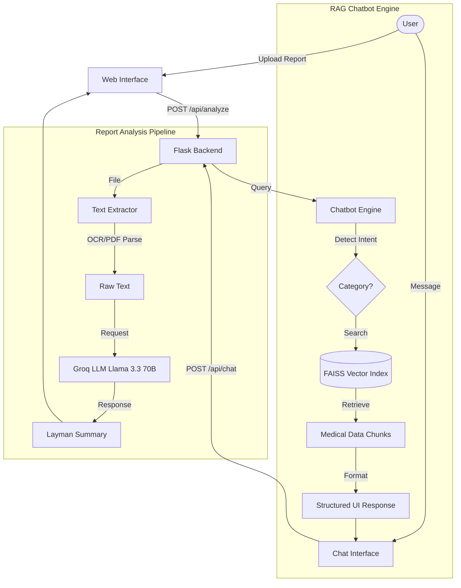

# 🩺 SwasthyaMitra: Medical Report Analyzer & Health Assistant

**SwasthyaMitra** is a state-of-the-art medical tool designed to bridge the gap between complex medical reports and patient understanding. By leveraging advanced OCR, RAG-based semantic search, and LLM summarization, it transforms technical lab results into easy-to-read layman summaries and provides a 24/7 intelligent health assistant.

---

## 🚀 Key Features

- **LLM-Powered Summarization**: Uses Groq's Llama 3.3 70B model to explain medical reports in plain English with emoji-coded status (✅ Normal, ⚠️ Elevated, ❌ Abnormal).
- **Multi-Format Extraction**: Robust text extraction from PDFs and Images (JPG/PNG/JPEG) using specialized OCR pipelines.
- **RAG Chatbot**: A Retrieval-Augmented Generation (RAG) assistant that provides instant information about doctors (Ahmedabad/Mumbai), hospitals, and health centers.
- **Offline Fallback**: Intelligent heuristic logic that provides basic analysis even when the LLM API is unavailable.
- **Modern UI/UX**: A sleek, dark-themed dashboard designed for clarity and ease of use.

---

## 🏗️ Project Architecture

The system is built on a modular Python/Flask architecture, separating the extraction pipeline, the analysis engine, and the conversational assistant.



---

## 🧪 Methodology & Methodology Flow

### 1. Medical Report Intelligence
1. **Extraction**: The system identifies the file type. PDFs are parsed using `pdfplumber`, while images undergo grayscale conversion and `Tesseract OCR` processing.
2. **Analysis**: Raw text is passed to **SwasthyaMitra-LLM (Llama 3.3)**. The model is prompted to identify test parameters, compare them against reference ranges, and explain the clinical significance in simple words.
3. **Safety First**: Every summary includes a mandatory medical disclaimer and follow-up suggestions.

### 2. Chatbot Semantic Intelligence (RAG)
1. **Indexing**: On startup, the engine loads doctor/hospital data from PDF/Excel, chunks it, and creates high-dimensional embeddings using `SentenceTransformers`.
2. **Search**: User queries (e.g., *"eye specialist in Maninagar"*) are converted into vectors and matched against the FAISS index using cosine similarity.
3. **Intent Recognition**: The bot detects if the user is looking for hospitals, health centers, or specific regional doctors to filter results appropriately.

---

## 🛠️ Technology Stack

| Component | Technology |
| :--- | :--- |
| **Backend** | Python, Flask |
| **Frontend** | HTML5, CSS3 (Modern Glassmorphism), Vanilla JS |
| **AI (LLM)** | Groq API (Llama 3.3 70B Versatile) |
| **OCR** | Tesseract OCR, Pytesseract, CV2, PDFPlumber |
| **Vector Search** | FAISS (Facebook AI Similarity Search) |
| **Embeddings** | all-MiniLM-L6-v2 (Sentence-Transformers) |

---

## ⚙️ Installation & Setup

### 1. Prerequisites
- Python 3.8+
- Tesseract OCR (installed on system)

### 2. Setup Procedure
```powershell
# Clone the repository
git clone <repo-url>
cd "Legal Lens/Text Extraction"

# Install dependencies
pip install flask pdfplumber pytesseract opencv-python groq sentence-transformers faiss-cpu openpyxl

# Set up API Key
# Create GROQ_API.txt and paste your API key from console.groq.com
```

### 3. Run the Application
```powershell
python app.py
```
Visit `http://localhost:5000` in your browser.

---

## 🚨 Disclaimer
*SwasthyaMitra is an AI-powered informative tool and does NOT provide medical diagnoses. Always consult with a qualified healthcare professional regarding any medical concerns or interpretation of your reports.*